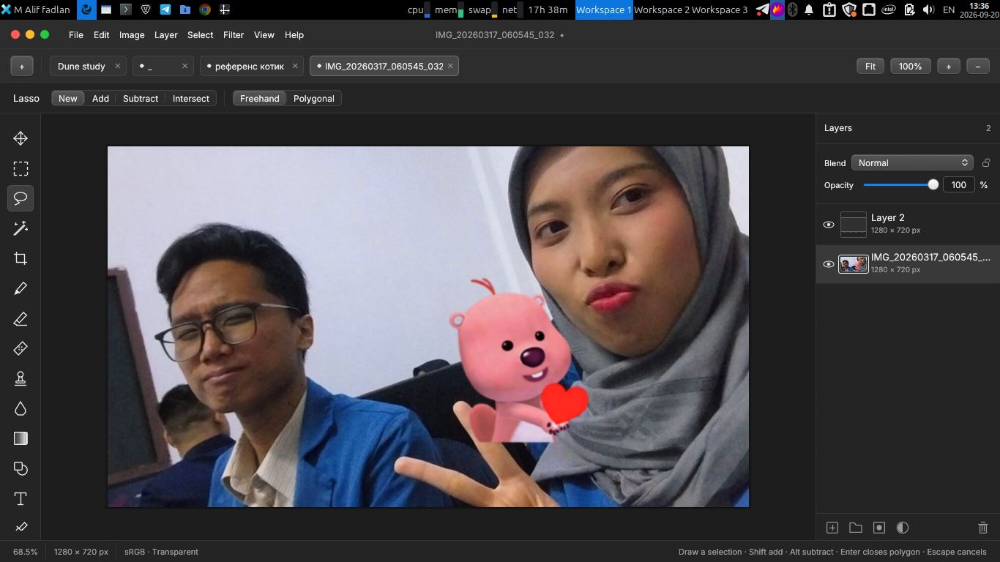

# mectov — the Photoshop alternative for Linux

A native Linux image editor for layered compositing, photo retouching, and camera RAW development.

mectov started as my Rust port of [Compositor](https://github.com/robbietilton/Compositor) — a macOS image editor whose approach I liked, but that I couldn't run on Linux. It is a work in progress; the current release is a demo with basic functionality.



## Features

- Compose with layers, groups, masks, blend modes, editable text, and shapes.
- Retouch with selections, brushes, clone stamp, healing, filters, and adjustment layers.
- Develop camera RAW files — Nikon NEF/NRW, Canon, Sony, Fujifilm, DNG and more — and return to their RAW settings at any time.
- Save editable `.mectov` projects, import Compositor packages, and export PNG, JPEG, TIFF, or WebP.

## Get started

Download a `.deb`, `.rpm`, or portable archive from [Releases](https://github.com/MAliffadlan/mectov/releases). Follow the [installation instructions](docs/USAGE.md#install-and-launch), then launch the demo:

```sh
mectov --demo
```

mectov supports Wayland and X11 and requires working Vulkan drivers. See the [user guide](docs/USAGE.md) for installation, file formats, and editing tools. To build from source, follow the [development guide](docs/DEVELOPMENT.md).

[Keyboard shortcuts](docs/SHORTCUTS.md) · [RAW workflow](docs/RAW.md) · [Project format](docs/FORMAT.md)

## License

mectov is [MIT licensed](LICENSE), © 2026 MAliffadlan. It builds on [Compositor](https://github.com/robbietilton/Compositor) by Wonder Assembly LLC, another MIT project worth checking out. Dependency licenses, the origin of borrowed code, and rebuild instructions are in the [third-party notices](THIRD_PARTY.md).
